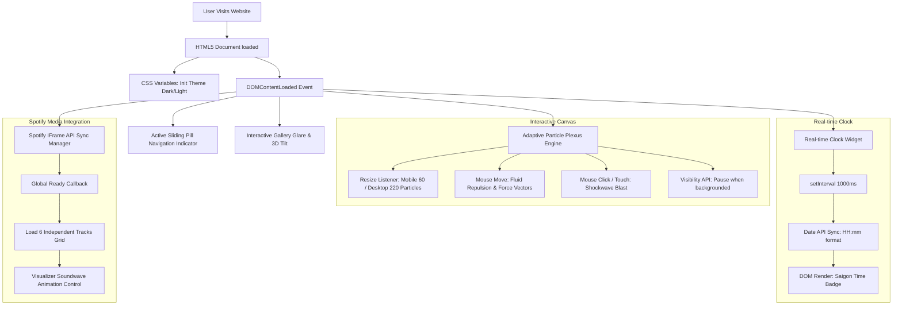

# BÁO CÁO TỔNG QUAN DỰ ÁN & LỊCH SỬ CẬP NHẬT WEBSITE PORTFOLIO

## Chủ sở hữu: Bảo Giang - IT Student

Báo cáo này cung cấp cái nhìn chi tiết về mặt kỹ thuật, kiến trúc mã nguồn, các công nghệ tương tác động và lịch sử cập nhật chi tiết theo từng phiên bản của dự án **Bao Giang Portfolio Website**.

---

## 1. TỔNG QUAN HỆ THỐNG KỸ THUẬT (TECH STACK & METRICS)

Dự án được xây dựng bằng phương pháp tiếp cận **Vanilla Core Performance First** nhằm tối ưu hóa thời gian tải trang, loại bỏ sự phụ thuộc vào các thư viện bên thứ ba, mang lại trải nghiệm ổn định trên cả thiết bị di động và máy tính.

| Danh mục | Công nghệ sử dụng | Mục đích / Chức năng |
| :--- | :--- | :--- |
| **Core Structure** | HTML5 Semantic | Xây dựng cấu trúc web chuẩn SEO, dễ tiếp cận (Accessibility). |
| **Styling Engine** | Vanilla CSS3 (Custom Variables) | Định nghĩa hệ thống theme động (Dark/Light), Glassmorphism, Responsive Grid/Flexbox. |
| **Logic & Animation** | Vanilla ES6+ Javascript | Quản lý logic Plexus Background, Interactive Gallery, 3D Tilt, Spotify API, và Real-time Clock. |
| **Design System** | Google Fonts (Inter, Space Grotesk) | Đồng bộ font chữ hiện đại, tối ưu hiển thị chữ số kỹ thuật số. |
| **Icon Set** | FontAwesome 6.5.1 | Cung cấp hệ thống biểu tượng vector sắc nét, tải nhanh. |
| **Hosting & CI/CD** | GitHub Pages & GitHub Actions | Tự động hóa quá trình đóng gói và phát hành (deploy) tự động mỗi khi đẩy code lên nhánh `main`. |

---

## 2. SƠ ĐỒ KIẾN TRÚC HOẠT ĐỘNG (SYSTEM ARCHITECTURE)

Dưới đây là sơ đồ luồng hoạt động tương tác thời gian thực và quản lý trạng thái động của Website Portfolio:

---

## 3. CHI TIẾT CÁC THÀNH PHẦN NỔI BẬT TRÊN WEBSITE

### 3.1. Động cơ Hạt Tương tác (Interactive Particle Plexus)
Được dựng hoàn toàn trên HTML5 `<canvas>` với các thuật toán vật lý tự viết:
*   **Fluid Repulsion (Đẩy nước):** Thay vì hút hạt đơn giản, động cơ tính toán vector khoảng cách để tạo lực đẩy hạt ra xa chuột khi rê qua giống như chuyển động của dòng nước.
*   **Momentum Transfer (Truyền động lượng):** Tính toán tốc độ di chuột (`mouse.vx`, `mouse.vy`) để truyền lực đập, khiến hạt bắn ra xa nhanh hơn khi di chuột nhanh.
*   **Adaptive Particle Engine:** Tự động điều chỉnh cấu hình theo phần cứng thiết bị. Mobile chạy 60 hạt trong phạm vi liên kết 55px; Desktop chạy 220 hạt trong phạm vi liên kết 80px để hạn chế gián đoạn.
*   **Shockwave (Sóng xung kích):** Sự kiện `mousedown` (Click) hoặc chạm màn hình điện thoại (`touchstart`) kích hoạt một vụ nổ sóng xung kích tại tâm điểm, đẩy toàn bộ hạt xung quanh văng xa 250px.
*   **Visibility API Integration:** Tự động phát hiện khi tab trình duyệt bị ẩn đi (user chuyển tab) để tạm dừng vòng lặp vẽ `requestAnimationFrame`, giúp tiết kiệm pin và giảm tải CPU.

### 3.2. Cụm Badge Trạng thái & Đồng hồ thời gian thực (Status Badge & Real-time Clock)
Nằm ngay trên phần tiêu đề giới thiệu tên, thiết kế dạng Glassmorphism:
*   **Đồng hồ Live 24h:** Hiển thị múi giờ Saigon (`Saigon Time`) dạng `23:59`, cập nhật tự động mỗi giây thông qua Javascript Date API.
*   **Hiệu ứng phát sáng đối xứng (Glow-symmetrical):** 
    *   Badge trạng thái sử dụng chấm nhấp nháy xanh lá cây (`pulse-dot`) đi kèm viền phát sáng xanh lá neon khi hover.
    *   Badge đồng hồ sử dụng chấm nhấp nháy xanh dương nhạt (`pulse-cyan`) đi kèm viền phát sáng xanh cyan neon khi hover.
*   **Responsive Layout:** Sử dụng hệ thống flexbox giúp hiển thị song song trên màn hình rộng, và tự động thu gọn hàng đứng trên thiết bị di động.

### 3.3. Tích hợp nhạc Spotify (Spotify Hybrid Integration)
*   **Mạng lưới độc lập:** Giao diện gồm 6 iframe bài hát độc lập trực quan, được xếp dạng grid kính mờ.
*   **Equalizer Animation:** Tích hợp bộ giả lập sóng âm thanh chuyển động liên tục phía trên danh sách phát nhạc để biểu thị tinh thần yêu âm nhạc sinh động.

### 3.4. Album ảnh thông minh (Interactive Glare Gallery)
*   **3D Parallax Tilt:** Di chuột vào 3 Khung ảnh bìa chính (Myself, Motorcycles, Daily) sẽ kích hoạt hiệu ứng nghiêng 3D chân thực, kèm theo một dải sáng quét qua bề mặt kính (`Glare effect`) theo góc nghiêng của chuột.
*   **Fallback Glass Placeholder Engine:** Nếu ảnh từ thư mục không tải được (lỗi đường dẫn hoặc tệp trống), Javascript tự động ẩn phần tử ảnh bị lỗi và render thay thế bằng một chiếc thẻ kính mờ kèm icon FontAwesome và dòng chữ báo lỗi *"Ảnh chưa tải lên"* phù hợp.
*   **Lightbox Media Control:** Trình xem ảnh phóng to toàn màn hình tích hợp đầy đủ tính năng: nút điều hướng qua lại (Next/Prev), hỗ trợ nút bấm bàn phím máy tính (ArrowLeft, ArrowRight, Escape) để chuyển ảnh hoặc tắt nhanh mượt mà.

---

## 4. LẠCH SỬ CẬP NHẬT THEO TỪNG PHIÊN BẢN (VERSION TIMELINE)

Dưới đây là bảng phân tích lịch sử cập nhật chi tiết, ánh xạ từng sự thay đổi mã nguồn trong Git thành các phiên bản theo trình tự thời gian tăng dần:

### THẾ HỆ 1.x - KHAI HOANG NỀN TẢNG VÀ HOÀN THIỆN ĐỒNG BỘ SƠ KHỞI
Giai đoạn nền móng ban đầu, xây dựng cấu trúc HTML, đồng nhất màu sắc toàn trang và thử nghiệm cuộn trang.

| Phiên bản | Mã Commit | Loại cập nhật | Nội dung mô tả chi tiết kỹ thuật | Tác động hệ thống |
| :--- | :--- | :--- | :--- | :--- |
| **version 1.0** | `1be1452` | **Initial Release** | Thiết lập cấu trúc giao diện Portfolio sơ khởi. Tùy biến lại hình dáng con trỏ chuột độc bản của Bảo Giang. | Đặt nền móng hình thành nên bộ khung của dự án. |
| **version 1.1.0** | `6784d3f` | **Content Tweaks** | Căn chỉnh và sửa lại các đoạn văn bản hiển thị lỗi font hoặc sai chính tả. | Chữ viết hiển thị chuẩn xác hơn. |
| **version 1.1.1** | `0ffbf1e` | **Git Merge** | Giải quyết xung đột (conflict) nhánh trong Git. | Đồng bộ mã nguồn chính xác. |
| **version 1.1.2** | `4bd6d55` | **Hotfix** | Sửa các lỗi nhỏ và tối ưu lại một số phần render logic ban đầu. | Hệ thống hoạt động ổn định hơn. |
| **version 1.2** | `fffa446` | **Gallery Sizing** | Tối ưu hóa chiều cao hiển thị của phần Gallery ảnh và sửa lỗi lưu cache. | Giúp bố cục trang ảnh trông gọn gàng, vừa vặn khung hình. |
| **version 1.3** | `5378df9` | **Script Query** | Tăng phiên bản `script.js` lên đầu `v2.1` để ép reload file script mới. | Tránh lỗi xung đột script cũ-mới trong cache. |
| **version 1.4** | `5abb625` | **Motorcycles Up** | Bổ sung thêm 2 bức ảnh độ phân giải cao vào Album Xe Máy (Motorcycles) và nâng asset lên `v2.2`. | Làm phong phú thêm bộ sưu tập hình ảnh cá nhân. |
| **version 1.5** | `420ffc8` | **Deep Black UI** | Đồng nhất tông màu nền đen của toàn bộ các phần trên website, sửa lỗi lệch tông xám giữa các khối. | Giao diện liền mạch, tạo cảm giác vô cực. |
| **version 1.6.0** | `eb9c395` `335a9b4` | **Snap & Playlist** | Thử nghiệm tính năng cuộn từng trang đầy màn hình (Snap scroll) và Thay thế 3 bài hát tĩnh mặc định sang Playlist Spotify cá nhân của Bảo Giang. | Thể hiện cá tính âm nhạc. |
| **version 1.6.1** | `6447454` | **Revert Snap** | Hủy bỏ tính năng cuộn từng trang đầy màn hình (Snap scroll). | Trả lại trải nghiệm cuộn tự do mượt mà, tự nhiên vốn có của web. |
| **version 1.7** | `1b950f6` | **Asset Cache bypass**| Nâng phiên bản truy vấn asset để ép trình duyệt bỏ qua cache cũ. | Hỗ trợ người dùng nhận thấy cập nhật mới. |
| **version 1.8** | `4452322` | **Scroll Optim** | Tối ưu hóa sự kiện cuộn trang bằng cờ hiệu `{ passive: true }` để giảm giật hình. | Triệt tiêu lỗi nháy trắng trình duyệt. |
| **version 1.9** | `f30315c` | **Spotify Theme** | Truyền cấu hình theme tối/sáng vào mã nhúng Spotify playlist. | Lưới phát nhạc đổi màu nền tự động ăn khớp theo Dark/Light Mode. |

---

### THẾ HỆ 2.x - KIẾN TẠO VẬT LÝ VÀ HIỆU ỨNG THỊ GIÁC 3D
Tập trung phát triển động cơ hạt chất lưu, lực đẩy vật lý và các chuyển động Parallax 3D trên bề mặt ảnh.

| Phiên bản | Mã Commit | Loại cập nhật | Nội dung mô tả chi tiết kỹ thuật | Tác động hệ thống |
| :--- | :--- | :--- | :--- | :--- |
| **version 2.0** | `9ba0676` | **3D Parallax Tilt** | Thiết lập hiệu ứng Parallax nghiêng 3D kết hợp quét ánh sáng chéo (Glare) khi di chuột vào khu vực hình ảnh Album. | Tạo chiều sâu cho phần Gallery hình ảnh. |
| **version 2.1** | `3c0ac70` | **Cache Busting** | Tăng phiên bản truy vấn của các tệp tĩnh (styles/scripts) lên `v2.4` để xóa bộ nhớ đệm cache của trình duyệt người dùng. | Đảm bảo người dùng luôn nhận được giao diện mới nhất ngay lập tức khi truy cập. |
| **version 2.2** | `caa05d8` | **Plexus Tuning** | Tối ưu hóa khoảng cách liên kết mạng lưới hạt plexus và tinh chỉnh lượng hạt nền. | Tăng tính nghệ thuật cho không gian nền. |
| **version 2.3** | `52bb6ac` | **Translation UI** | Dịch toàn bộ nhãn hành động ở Album ảnh sang tiếng Anh và tăng số lượng hạt nền máy tính lên `160` hạt. | Chuyên nghiệp hóa ngôn ngữ hiển thị quốc tế. |
| **version 2.4** | `e7a18a1` | **Adaptive Plexus** | Viết Động cơ Hạt Thích ứng (Adaptive Particle Engine) hỗ trợ tự động cắt giảm cấu hình trên Mobile và thêm sóng xung kích khi tap. | Di động chạy mượt mà và có thêm tương tác gõ màn hình tạo sóng nước chân thực. |
| **version 2.5** | `23cdaca` | **Particle Lifespan** | Triển khai vòng đời cho hạt (Lifespan) và cơ chế tự động tái sinh tại rìa màn hình khi hạt bị hấp thụ hoặc quá tuổi. | Các hạt nền tự động sinh-tử liên tục, duy trì sự cân bằng mật độ. |
| **version 2.6** | `c47373c` | **Plexus Opacity** | Tăng mật độ số lượng hạt nền và giảm độ mờ (opacity) của các đường nối plexus liên kết. | Giao diện nền có chiều sâu hơn mà không bị rối mắt. |
| **version 2.7** | `b5c6e30` | **Fluid Repulsion** | Thay thế lực hút hạt cơ bản bằng lực đẩy chất lưu (Fluid Mouse Repulsion). | Tạo cảm giác các hạt như dòng nước rẽ ra khi chuột đi qua. |
| **version 2.8** | `c780354` | **Physics Momentum** | Thiết lập thuật toán truyền động lượng vật lý dựa trên vận tốc di chuyển chuột (Momentum Transfer). | Hạt bay tự nhiên và phản hồi sinh động theo gia tốc của tay. |

---

### THẾ HỆ 3.x - ĐỒNG BỘ ĐA PHƯƠNG TIỆN & HỆ THỐNG LIVE WIDGET
Tập trung vào hoàn thiện trải nghiệm kết nối thông minh, tối ưu hóa các sự kiện cuộn trang và phát hành widget thời gian thực.

| Phiên bản | Mã Commit | Loại cập nhật | Nội dung mô tả chi tiết kỹ thuật | Tác động hệ thống |
| :--- | :--- | :--- | :--- | :--- |
| **version 2.9.1** | `4487c18` | **Music Grid 6x** | Nâng cấp trình nghe nhạc Spotify lên thành lưới 6 bài hát độc lập đại diện cho cá tính âm nhạc cá nhân. | Đa dạng nội dung nghe nhạc, tăng tương tác của khách ghé thăm. |
| **version 2.9.2** | `9d12928` | **Spotify Sync API** | Kết nối Spotify IFrame API đồng bộ bật/tắt sóng nhạc động và điều chỉnh điểm gãy responsive lưới nhạc ở `580px`. | Hiển thị phù hợp lưới nhạc trên mọi kích cỡ màn hình di động lớn nhỏ. |
| **version 3.0.0** | `09256b0` | **Race Condition Fix**| Khắc phục lỗi bất đồng bộ (Race Condition) trong quá trình khởi tạo API Spotify bằng cách khai báo callback globally. | Trình phát nhạc hoạt động ổn định trong mọi lượt tải trang. |
| **version 3.0.1** | `924a7cc` | **Fail-safe Spotify** | Triển khai kiến trúc dự phòng (fail-safe) cho trình phát nhạc Spotify giữa iframe tĩnh và API callback động. | Tránh lỗi dừng tải trang khi API Spotify phản hồi chậm hoặc bị chặn. |
| **version 3.0.2** | `5476c56` | **Refactor Soundwave**| Đưa hoạt ảnh sóng âm thanh của nhạc về vòng lặp liên tục và tinh giản cấu trúc mã nguồn Iframe của Spotify. | Tải trang nhanh hơn, giảm tải hoạt động CPU. |
| **version 3.1** | `05432f1` | **Perf Navigation** | Nâng cấp menu điều hướng tự động trượt bằng `IntersectionObserver`. Sử dụng thuộc tính `translate3d` để kích hoạt tăng tốc phần cứng phần menu. | Triệt tiêu hoàn toàn độ trễ layout thrashing khi cuộn. Menu lướt mượt mà. |
| **version 3.2** | `0d308f7` | **Feat & UI Glow** | Bổ sung widget đồng hồ Saigon Time dạng `23:59`. Đồng nhất cường độ phát sáng hover cho 2 chiếc badge bằng hiệu ứng quầng sáng `box-shadow` đồng điệu màu sắc (Green Glow và Cyan Glow). | Giao diện Hero đạt sự cân bằng thẩm mỹ, mang đậm hơi thở công nghệ cao. |
| **version 3.3** | `1a6b475` | **Nav & Footer Polish** | Nâng cấp hoạt ảnh viên thuốc trượt (Nav Pill) với hiệu ứng glow bóng mờ, bổ sung nút "Home" và phủ lớp kính mờ (Glassmorphism) cùng viền sáng cho khu vực Footer. | Giao diện tổng thể liền mạch, phần viền các khối nổi bật và điều hướng thân thiện hơn. |
| **version 3.4** | `b343118` | **3D Music Coverflow** | Chuyển đổi grid âm nhạc thành dạng thẻ đứng xoay 3D (Coverflow) bằng Swiper.js, ép tăng tốc phần cứng GPU (`translateZ(0)`) cho các thẻ iframe Spotify và sử dụng dải màu album tự động. | Trải nghiệm tương tác với danh sách nhạc mượt mà như native app, xóa bỏ hoàn toàn giật lag khi chuyển cảnh 3D. |
| **version 3.5** | `f574241` | **Music Swipe & Drag Fix** | Bổ sung lớp phủ vô hình (transparent pseudo-element overlay) lên phần trên của iframe Spotify để ngăn chặn hiện tượng iframe nuốt sự kiện cảm ứng/chuột. | Kích hoạt lại khả năng vuốt/chuyển bài mượt mà trên điện thoại và kéo thả bằng chuột trên laptop, đồng thời vẫn giữ được khả năng tương tác với nút Play ở góc dưới. |

---

## 5. GỢI Ý ĐỊNH HƯỚNG PHÁT TRIỂN TIẾP THEO (FUTURE ROADMAP)

Để đưa website Portfolio của Bảo Giang tốt hơn nữa, dưới đây là một số đề xuất nâng cấp tính năng bạn có thể cân nhắc triển khai trong tương lai:

1.  **Tích hợp Form liên hệ (Contact Form Backend Integration):**
    *   *Hiện tại:* Nút Get in touch mới chỉ mở ứng dụng Mail mặc định (`mailto:`).
    *   *Nâng cấp:* Tạo một form nhập thông tin (Tên, Email, Lời nhắn) ngay trên web và sử dụng dịch vụ như **Formspree** hoặc **EmailJS** để gửi trực tiếp thông tin liên hệ của khách hàng vào Gmail của bạn mà họ không cần rời khỏi trang web.
2.  **Trang con viết Blog cá nhân bằng Markdown (Minimalist Markdown Blog Section):**
    *   *Mục đích:* Giúp bạn chia sẻ các bài viết kỹ thuật công nghệ học được tại trường Van Lang, các hành trình đi phượt bằng xe máy, hay kinh nghiệm chụp ảnh.
    *   *Giải pháp:* Sử dụng một tệp JSON lưu trữ danh sách bài viết Markdown, Javascript tự động phân tích cú pháp (parse) để hiển thị thành một trang đọc bài viết công nghệ.
3.  **Tối ưu hóa hình ảnh tự động (WebP Image Conversion):**
    *   *Hiện tại:* Rất nhiều ảnh trong album gallery của bạn đang sử dụng định dạng `.jpg` hoặc `.png` dung lượng gốc khá lớn.
    *   *Nâng cấp:* Chuyển đổi toàn bộ sang định dạng thế mới **`.webp`** để giảm dung lượng ảnh mà vẫn giữ nguyên độ nét, giúp web tải nhanh chóng ngay cả khi dùng mạng di động yếu.

---

> [!NOTE]
> Báo cáo này đã được biên soạn và lưu trữ trực tiếp trong tệp báo cáo kỹ thuật dự án tại đường dẫn:
> [project_overview_report.md](file:///c:/Antigravity/Portfolio/portfolio/project_overview_report.md)

> [!TIP]
> Bạn luôn có thể theo dõi và cập nhật thêm các đầu mục công việc hay ý tưởng mới cho dự án bằng cách sử dụng các slash command hữu ích như `/goal` để lập kế hoạch dài hạn hoặc `/schedule` để đặt lịch bảo trì website định kỳ.
